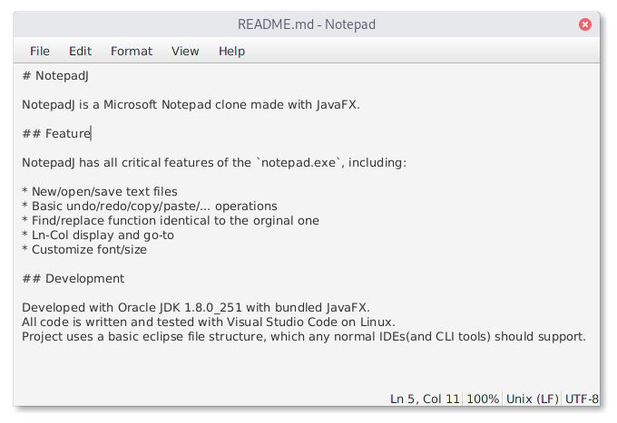

# NotepadJ

NotepadJ is a Microsoft Notepad clone made with JavaFX.

## Feature

NotepadJ has all critical features of the `notepad.exe`, including:

* New/open/save text files
* Basic undo/redo/copy/paste/... operations
* Find/replace function identical to the orginal one
* Ln-Col display and go-to
* Customize font/size

## Development

Developed with Oracle JDK 1.8.0_251 with bundled JavaFX.  
All code is written and tested with Visual Studio Code on Linux.  
Project uses a basic eclipse file structure, which any normal IDEs(and CLI tools) should support.  
Windows support is modest.
